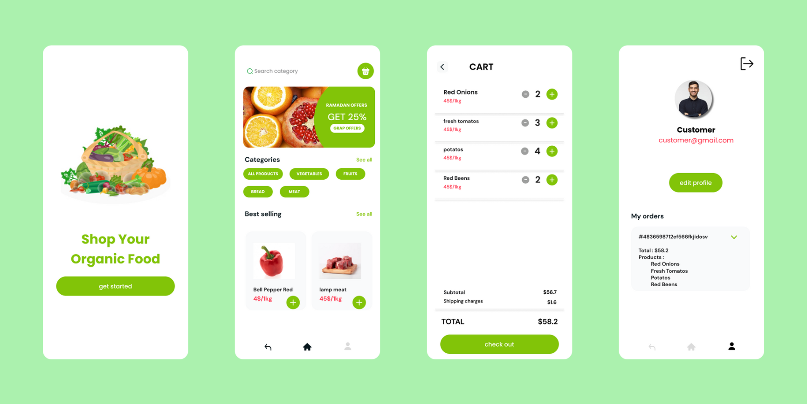

# Organic Food E-Commerce App

## Description

This is an organic food e-commerce application built using Ionic6 and Angular17. The app allows users to browse organic food products, add them to cart, and proceed with the checkout process.

## Features

- User authentication and authorization
- Browse organic food products
- Add products to the cart
- Manage cart (add, remove, update quantities)
- Checkout process
- CRUD operations for vendors
- Vendor authentication
- Add, delete, and update product listings for vendors
- Customer registration and authentication

## Technologies Used

- Ionic6
- Angular17
- MongoDB
- Python (Flask) for backend services

